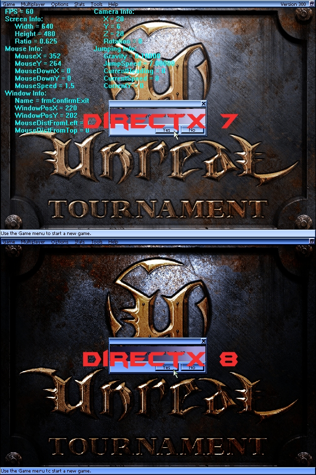

<div align="center">

## Unreal Tournament Clone \(One More Time\!\)


</div>

### Description

First off, I just want to say that I didn't even bother trying to upload the source to PSC since I already know it can't handle a 5MB file. =) However, there is a link to the file below. Alrighty, down to the nitty gritty. This update is jam packed with new goodies. I have revamped almost the whole code for the DirectX 7 version. It uses my own "engine" so to speak. But I'm sure you're asking "DirectX 7 version? There's a different version?" Yep, that's right. There is. I've ported the clone to DirectX 8. Woo hoo! I haven't coded the 3D aspect of it, but I was able to create a DirectX 8 "engine" to do all the 2D stuff. That's right. I said 2D. It took me awhile, but I figured out how to do it. And I didn't use anybody else's code. Cool huh? =) Anyway, you can see from the screen shot that the DirectX 8 version looks a lot different. You wanna know why, right? Well, I couldn't tell you if I wanted too! Because I don't know! For some reason when I ported it to DirectX 8, everything became really dark. Guess I'll have to figure out some Gamma control stuff. Anyhoo, I hope you enjoy it. The links to the files are located below. Enjoy! Oh, and I wouldn't be a true PSCer if I didn't ask you to do this, but, would you guys please vote, or at least leave some comments! They are appreciated ya know. =)
 
### More Info
 


<span>             |<span>
---                |---
**Submitted On**   |
**By**             |[Chris Dwinell](https://github.com/Planet-Source-Code/PSCIndex/blob/master/ByAuthor/chris-dwinell.md)
**Level**          |Advanced
**User Rating**    |5.0 (45 globes from 9 users)
**Compatibility**  |VB 6\.0
**Category**       |[Games](https://github.com/Planet-Source-Code/PSCIndex/blob/master/ByCategory/games__1-38.md)
**World**          |[Visual Basic](https://github.com/Planet-Source-Code/PSCIndex/blob/master/ByWorld/visual-basic.md)
**Archive File**   |[](https://github.com/Planet-Source-Code/chris-dwinell-unreal-tournament-clone-one-more-time__1-37501/archive/master.zip)


### Source Code

```
You can find the source code on my web site in the "Downloads" section:
http://www.mtekdesigns.com/
```

